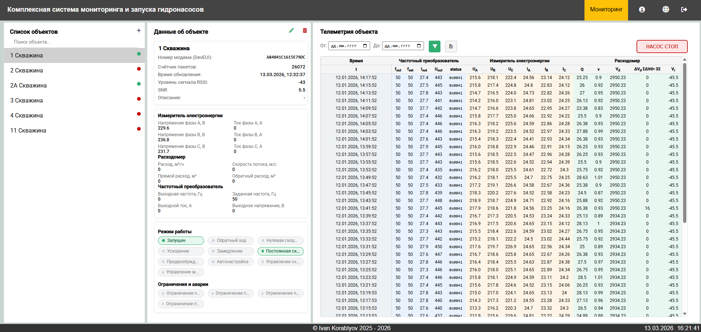
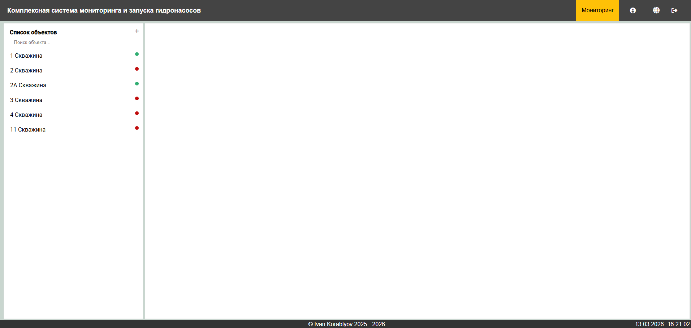
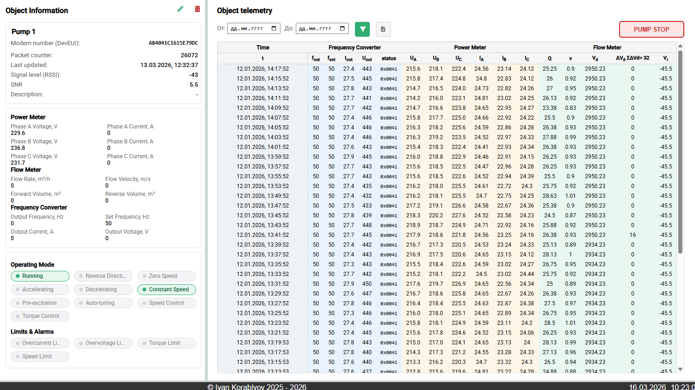

# Water Pump Monitoring System

Industrial IoT system for monitoring and controlling water pumps built with **NestJS**, **Angular**, **MQTT**, and **WebSockets**.

The system provides real-time telemetry monitoring, device status tracking, and remote control of pump equipment through a web dashboard.

---

## Features

- Real-time telemetry monitoring
- MQTT device communication
- Live updates via WebSockets
- Pump start / stop control
- Device management
- JWT authentication
- Automatic default admin creation
- Telemetry storage in MongoDB
- Operator monitoring dashboard

---

## Tech Stack

### Backend
- NestJS
- MongoDB + Mongoose
- MQTT
- WebSockets (Socket.IO)
- JWT + Passport
- bcrypt

### Frontend
- Angular 18
- Angular Material
- SCSS
- ngx-socket-io
- ngx-mqtt
- ngx-translate
- xlsx

---

## Architecture

```text
Devices / Pump Controllers
        │
        ▼
    MQTT Broker
        │
        ▼
   NestJS Backend
        │
        ├── MongoDB
        │
        └── WebSocket Gateway
                │
                ▼
        Angular Client Dashboard
```

Telemetry is received via **MQTT**, processed by the backend, stored in **MongoDB**, and pushed to the frontend using **WebSockets**.

---

## Project Structure

```text
water-pump-monitoring
│
├── water-pump-api        # NestJS backend
├── water-pump-client     # Angular frontend
├── docs                  # screenshots
│
├── README.md
└── .gitignore
```

---

## Installation

Clone the repository:

```bash
git clone https://github.com/IvanKorb/water-pump-monitoring.git
cd water-pump-monitoring
```

---

## Backend Setup

```bash
cd water-pump-api
npm install
npm run start
```

Backend runs on:

```text
http://localhost:3000
```

---

## Frontend Setup

```bash
cd water-pump-client
npm install
npm start
```

Frontend runs on:

```text
http://localhost:4200
```

---

## Environment Configuration

Create `.env` file inside **water-pump-api**:

```env
MONGO_URI=mongodb://127.0.0.1:27017/mtr-db
MQTT_HOST=localhost:1883
MQTT_USER=your_mqtt_user
MQTT_PASS=your_mqtt_password
JWT_SECRET=change_me
CORS_ORIGIN=http://localhost:4200
ADMIN_LOGIN=admin
ADMIN_PASSWORD=admin
DEFAULT_ADMIN_ENABLED=true
APPLICATION_ID=1
```

---

## Default Admin

When the backend starts, a default administrator can be created automatically.

```text
login: admin
password: admin
```

---

## MQTT Integration

Devices publish telemetry to MQTT topics.

Example topic:

```text
application/{appId}/device/{devEui}/event/up
```

The backend processes incoming packets and forwards telemetry to connected WebSocket clients.

---

## Telemetry Flow

```text
Device → MQTT → NestJS → MongoDB → WebSocket → Angular Dashboard
```

---

## Screenshots








---

## Author

Ivan Korablyov  
Senior Full-stack JavaScript / TypeScript Engineer  
Astana, Kazakhstan